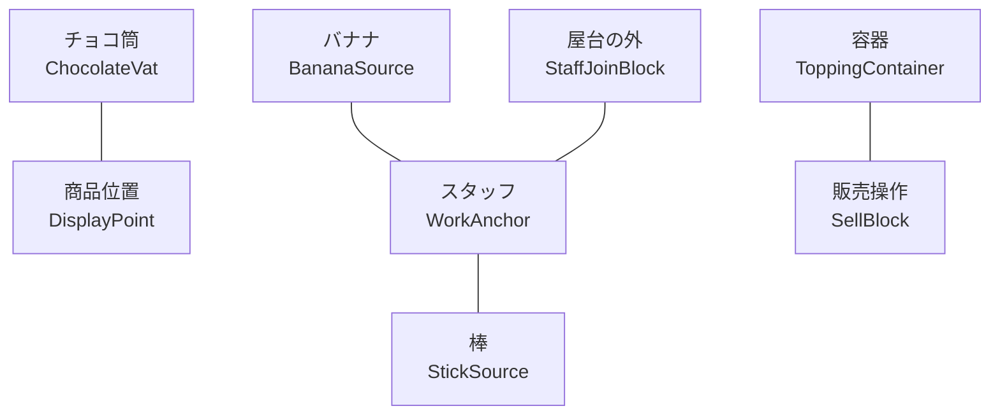

# 屋台の推奨構図

スタッフは `WorkAnchor` から移動できないため、すべての設備を10スタッド以内へ配置します。下図は上から見た例です。

`WorkAnchor` を原点とした配置例です。Studio の屋台サイズに合わせて調整してください。

| 部品 | X | Z | 向き・注意 |
|---|---:|---:|---|
| `WorkAnchor` | 0 | 0 | 屋台の中央。スタッフの初期方向 |
| `BananaSource` | -4 | -1 | 左側 |
| `StickSource` | 4 | -1 | 右側 |
| `ChocolateVat` | -3 | -5 | 正面左。漬け工程中はこの方向へ固定 |
| `ToppingContainer` | 1 | -5 | 正面中央 |
| `SellBlock` | 4 | -5 | 正面右 |
| `DisplayPoint` | 4 | -7 | 客側。完成品に使いたい角度へ回転 |
| `StaffJoinBlock` | 0 | 4 | 屋台の外側 |

## おすすめサイズ

- 屋台全体：横12〜16スタッド、奥行き8〜12スタッド
- 作業台の高さ：3〜4スタッド
- 選択する部品：少なくとも1.5スタッド四方
- 客と販売商品との距離：ProximityPromptが届く10スタッド以内

## 複数屋台

屋台モデルを複製し、Modelの `StallId` だけ変更します。例：

- `choco-banana-01`
- `choco-banana-02`

同じ `StallId` を重複させると、スタッフ枠と販売商品が共有されるため重複させないでください。

